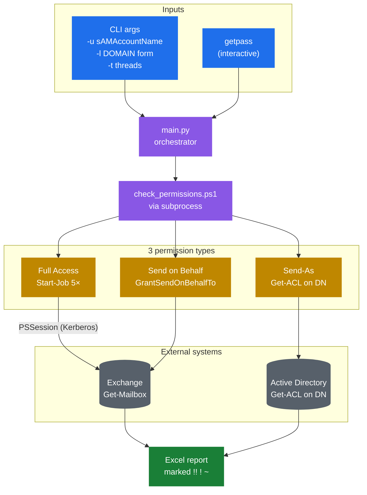

# Exchange Mailbox Permissions Audit

Утилита проверяет, какие делегированные права есть у указанного пользователя
(или у его AD-групп, в т.ч. вложенных) на почтовые ящики Microsoft Exchange.
Проверяются три типа прав: **Full Access**, **Send-As** и **Send on Behalf**.

Применяется в SOC при расследованиях, увольнениях, ротации сотрудников —
когда нужно быстро понять, к каким чужим ящикам у пользователя сохраняется
доступ.

## Особенности

- **Параллелизация Full Access** через PowerShell `Start-Job` (по умолчанию
  5 потоков). На 3000+ ящиках сокращает время с ~60 минут до ~10.
- **Send-As через `Get-ACL`** на DN ящика вместо `Get-ADPermission` —
  быстрее и надёжнее. Проверка по `ObjectType == SendAs-GUID`.
- **Send on Behalf** — атрибут `GrantSendOnBehalfTo`, читается из уже
  загруженных Mailbox без дополнительных вызовов.
- **Предзагрузка `Description`** всех Exchange-пользователей одним
  AD-запросом — чтобы не дёргать AD по каждому ящику.
- **HashSet с OrdinalIgnoreCase** для O(1)-поиска совпадений ACE.
- **Excel-отчёт** с маркировкой типа права (`!!`, `!`, `~`).

## Архитектура



Python-оркестратор запрашивает пароль интерактивно и через `subprocess`
запускает локальный PowerShell-скрипт. Скрипт устанавливает PSSession
к Exchange по Kerberos, после чего собирает 3 типа прав параллельными
методами: Full Access через `Start-Job` (по умолчанию 5 потоков, каждый
со своей PSSession), Send-As через `Get-ACL` на DN объекта в AD напрямую
(быстрее `Get-ADPermission`), Send on Behalf через атрибут
`GrantSendOnBehalfTo` из `Get-Mailbox`. Результат сводится в Excel-отчёт
с цветовой маркировкой типов прав (`!!` Full Access, `!` Send-As,
`~` Send on Behalf).

## Хранение секретов

Пароль учётной записи запрашивается через **`getpass.getpass()`** при
каждом запуске. Не сохраняется нигде, не попадает в историю команд и в
аргументы CLI. Keyring не используется намеренно: утилита
интерактивная — каждый аналитик подключается под своей учёткой, и автомат
здесь не нужен.

## Использование

```bash
# Минимально
py main.py -u j.doe -l CORP\j.doe

# С указанием числа потоков и явным выходным файлом
py main.py -u j.doe -l CORP\j.doe -t 5 -o report.xlsx

# Debug-режим — PS пишет лог каждого джоба в scripts/debug_logs/
py main.py -u j.doe -l CORP\j.doe -d
```

| Флаг | Описание |
|------|----------|
| `-u` | sAMAccountName проверяемого пользователя |
| `-l` | Логин для подключения (`DOMAIN\user`) |
| `-s` | URL PowerShell-эндпоинта Exchange (опц., по умолчанию из `config.py`) |
| `-t` | Количество параллельных джобов Full Access (1–18) |
| `-o` | Путь к Excel-отчёту |
| `-v` | Verbose-режим (DEBUG-логи в консоль) |
| `-d` | Сохранять debug-лог каждого джоба |

## Производительность

На инсталляции с ~3000 почтовых ящиков:

| Этап | Время | Метод |
|------|-------|-------|
| Send-As | ~2 мин | `Get-ACL` на каждый DN, фильтр по SendAs-GUID |
| Send on Behalf | <30 с | Чтение `GrantSendOnBehalfTo` из Mailbox |
| Full Access (5×) | ~7 мин | `Start-Job`, батчи по `total/threads` |
| **Итого** | **~10 мин** | Против ~60 мин однопоточно |

## Требования

- **Windows** — для PowerShell Remoting к Exchange (нужен RSAT или
  Exchange-снапин, модуль `ActiveDirectory`).
- **Учётная запись** с правами `View-Only Recipients` (или эквивалентом)
  в Exchange + правом читать ACL на DN объектов AD.

## Технологии

Python 3.14+ (оркестрация и Excel), PowerShell 5.1+ (Exchange PSRemoting),
`openpyxl`, Kerberos.

## Лицензия

MIT — см. файл [LICENSE](LICENSE).

## Disclaimer

Это обезличенный сэмпл кода для технических собеседований. Оригинальный
проект разрабатывался автором в рамках работы по информационной
безопасности. История коммитов оригинального репозитория не публикуется —
здесь представлена итоговая версия с заменёнными корпоративными
идентификаторами (домены, имена серверов, логины) на нейтральные
плейсхолдеры (`corp.local`, `example.com`, `j.doe` и т.п.).

Перед использованием в своей инфраструктуре нужно адаптировать
конфигурационные параметры под свою среду.

